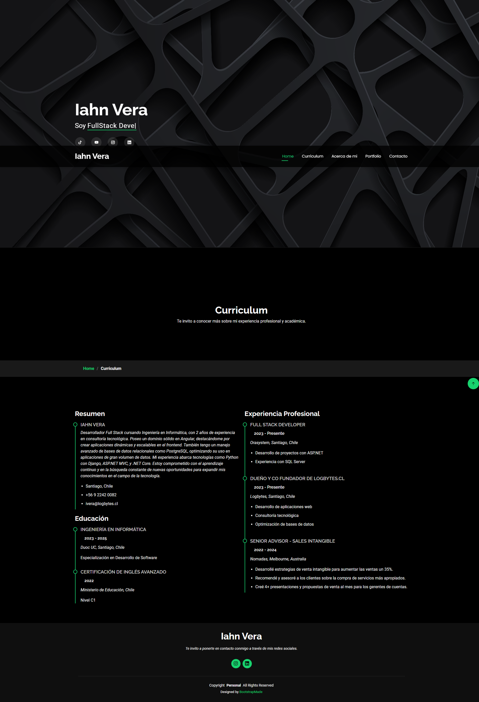
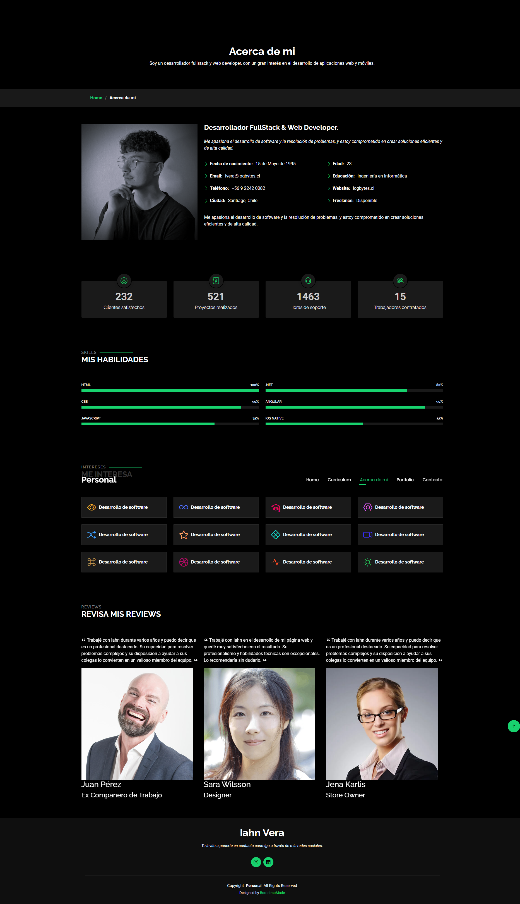
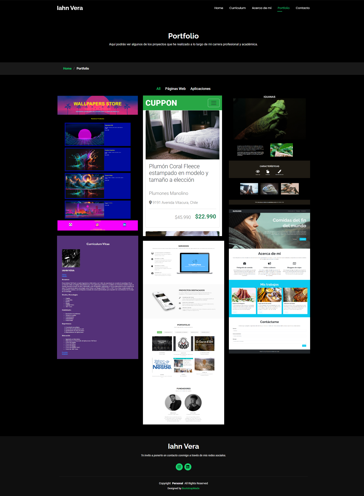
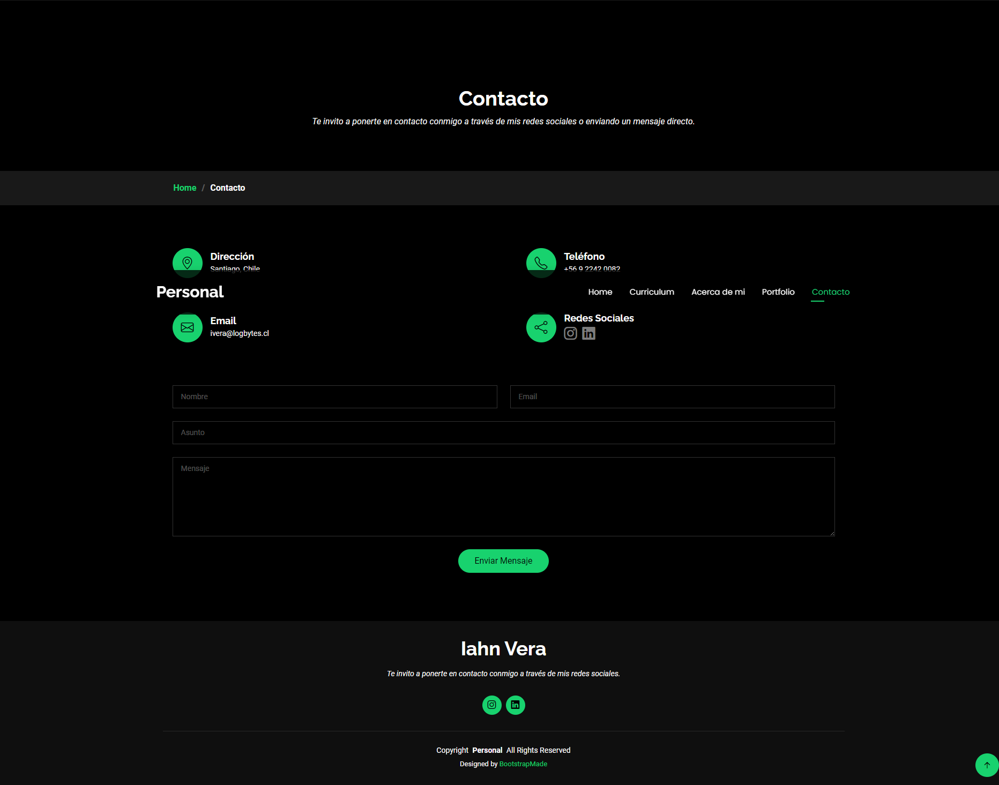

# Portafolio Personal

Este es un portafolio personal creado utilizando una plantilla de Bootstrap. El portafolio incluye varias secciones como Inicio, Curriculum, Acerca de mí, Portfolio y Contacto.

## Vista Principal

A continuación se muestra una vista previa de la página de inicio del portafolio:

## Secciones del Portafolio

### Inicio
La página de inicio proporciona una introducción general y enlaces a las diferentes secciones del portafolio.

### Curriculum
En esta sección se muestra el curriculum vitae del desarrollador, incluyendo su experiencia laboral y habilidades.

### Acerca de mí 
Esta sección proporciona información detallada sobre el desarrollador, incluyendo su background y sus intereses.

### Portfolio 
Aquí se pueden ver los proyectos realizados por el desarrollador, con descripciones y enlaces a los mismos.

### Contacto 
En esta sección se proporcionan los medios para ponerse en contacto con el desarrollador, incluyendo un formulario de contacto y enlaces a sus redes sociales.

## Tecnologías Utilizadas

- HTML5
- CSS3
- Bootstrap 5
- JavaScript

## Autor

Este portafolio fue creado por Iahn Vera. Puedes ponerte en contacto con él a través de la sección de contacto del portafolio.

## Licencia

Este proyecto está licenciado bajo la Licencia MIT. Para más detalles, consulta el archivo LICENSE.

¡Gracias por visitar mi portafolio!
